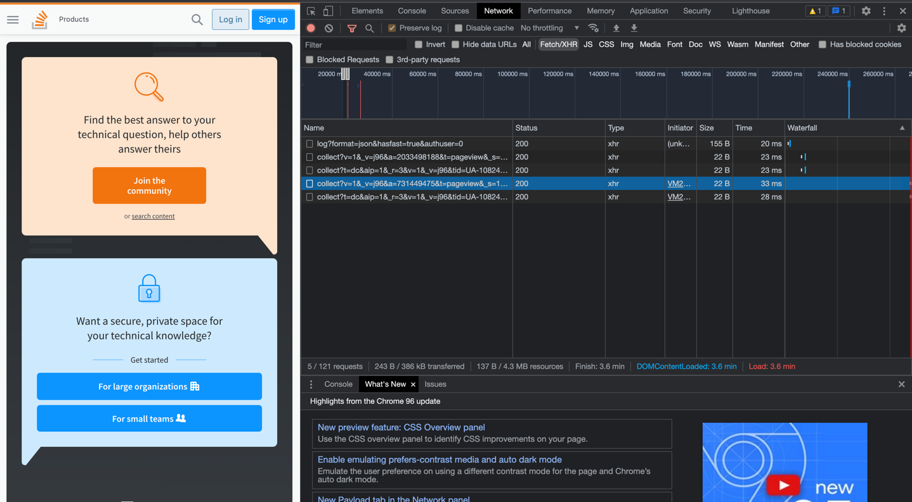

#### 1. Работа c HTTP через телнет.
- Подключитесь утилитой телнет к сайту stackoverflow.com
`telnet stackoverflow.com 80`
- отправьте HTTP запрос
```bash
GET /questions HTTP/1.0
HOST: stackoverflow.com
[press enter]
[press enter]
```
- В ответе укажите полученный HTTP код, что он означает?
```buildoutcfg
HTTP/1.1 301 Moved Permanently
cache-control: no-cache, no-store, must-revalidate
location: https://stackoverflow.com/questions
```
301 HTTP запрос означает, что запрошенный адрес навсегда перемещен на адрес, укзанный в хидере location

#### 2. Повторите задание 1 в браузере, используя консоль разработчика F12.
- откройте вкладку `Network`
- отправьте запрос http://stackoverflow.com
- найдите первый ответ HTTP сервера, откройте вкладку `Headers`
- укажите в ответе полученный HTTP код.
- проверьте время загрузки страницы, какой запрос обрабатывался дольше всего?
- приложите скриншот консоли браузера в ответ.
первый полученный код - 200, означает, что все ок
дольше всего обрабатывается запрос к https://www.google-analytics.com/j/collect?v=1&_v=j96&a=731449475&t=pageview&_s=1&dl=https%3A%2F%2Fstackoverflow.com%2F&dp=%2F&ul=ru&de=UTF-8&dt=Stack%20Overflow%20-%20Where%20Developers%20Learn%2C%20Share%2C%20%26%20Build%20Careers&sd=30-bit&sr=1440x900&vp=475x789&je=0&_u=SCCACEABFAAAAC~&jid=498394020&gjid=285647438&cid=203840263.1618842783&tid=UA-108242619-1&_gid=604721302.1637705603&_r=1&cd42=0&cd3=Home%2FIndex&cd7=1637706005.1381478741&cd6=203840263.1618842783&cd8=2021-11-23T22%3A20%3A06.359%2B03%3A00&cd11=https%3A%2F%2Fstackoverflow.com%2F&z=375970184  

#### 3. Какой IP адрес у вас в интернете?
5.18.170.232
#### 4. Какому провайдеру принадлежит ваш IP адрес? Какой автономной системе AS? Воспользуйтесь утилитой `whois`
Z-Telecom, AS41733
#### 5. Через какие сети проходит пакет, отправленный с вашего компьютера на адрес 8.8.8.8? Через какие AS? Воспользуйтесь утилитой `traceroute`
```buildoutcfg
vagrant@vagrant:~$ traceroute -An 8.8.8.8
traceroute to 8.8.8.8 (8.8.8.8), 30 hops max, 60 byte packets
 1  10.0.2.2 [*]  0.154 ms  0.128 ms  0.114 ms
 2  192.168.1.1 [*]  29.486 ms  29.470 ms  29.459 ms
 3  172.31.254.62 [*]  29.450 ms 172.31.254.26 [*]  29.345 ms 172.31.254.62 [*]  29.330 ms
 4  5.18.6.245 [AS41733]  163.360 ms  163.295 ms  163.278 ms
 5  188.234.131.158 [AS9049]  163.257 ms  163.103 ms  163.070 ms
 6  188.234.131.159 [AS9049]  29.002 ms 72.14.214.138 [AS15169]  4.376 ms  4.927 ms
 7  * * *
 8  216.239.59.142 [AS15169]  5.870 ms  5.855 ms 209.85.245.238 [AS15169]  5.204 ms
 9  74.125.244.180 [AS15169]  8.386 ms 74.125.244.133 [AS15169]  8.352 ms 74.125.244.181 [AS15169]  8.339 ms
10  72.14.232.84 [AS15169]  7.224 ms 216.239.48.163 [AS15169]  9.723 ms 142.251.61.221 [AS15169]  10.608 ms
11  142.251.61.221 [AS15169]  10.561 ms 216.239.47.201 [AS15169]  13.462 ms 216.239.48.163 [AS15169]  9.429 ms
12  216.239.63.25 [AS15169]  10.284 ms * 172.253.64.53 [AS15169]  11.593 ms
13  * * *
14  * * *
15  * * *
16  * * *
17  * * *
18  * * *
19  * * *
20  * * *
21  * 8.8.8.8 [AS15169]  12.983 ms *
```
#### 6. Повторите задание 5 в утилите `mtr`. На каком участке наибольшая задержка - delay?
```buildoutcfg
                                                                                                         Packets               Pings
 Host                                                                                                   Loss%   Snt   Last   Avg  Best  Wrst StDev
 1. AS???    10.0.2.2                                                                                    0.0%    22    0.3   0.4   0.2   0.6   0.1
 2. AS???    192.168.1.1                                                                                 0.0%    22    3.3   3.9   1.8  26.6   5.2
 3. AS???    172.31.254.26                                                                               4.5%    22   14.8  13.9   4.7  53.2  13.7
    AS???    172.31.254.62
 4. AS41733  5.18.6.245                                                                                  0.0%    22    5.9   8.5   4.6  39.2   8.0
 5. AS9049   188.234.131.158                                                                             0.0%    22    7.1   8.0   5.2  13.9   2.4
 6. AS15169  72.14.214.138                                                                               0.0%    22    6.9   6.2   4.3  18.5   3.3
 7. AS15169  74.125.244.129                                                                              0.0%    21    7.9   7.3   5.7  17.1   2.5
 8. AS15169  74.125.244.132                                                                              0.0%    21    5.0  11.4   4.8  56.7  15.0
 9. AS15169  216.239.48.163                                                                              0.0%    21   12.2  14.8   8.4  50.7  10.1
10. AS15169  216.239.62.9                                                                                0.0%    21    8.9  10.3   7.8  24.9   4.2
11. (waiting for reply)
12. (waiting for reply)
13. (waiting for reply)
14. (waiting for reply)
15. (waiting for reply)
16. (waiting for reply)
17. (waiting for reply)
18. (waiting for reply)
19. (waiting for reply)20. (waiting for reply)
21. (waiting for reply)22. AS15169  8.8.8.8                                                             0.0%    21    9.4  10.2   7.9  18.0   2.4
```
наибольшая задержка была на шаге 8. AS15169  74.125.244.132 , но при этом худшее среднее значение по задержке -  9. AS15169  216.239.48.163
#### 7. Какие DNS сервера отвечают за доменное имя dns.google? Какие A записи? воспользуйтесь утилитой `dig`
DNS сервера:
```buildoutcfg
dns.google.		10800	IN	NS	ns1.zdns.google.
dns.google.		10800	IN	NS	ns3.zdns.google.
dns.google.		10800	IN	NS	ns2.zdns.google.
dns.google.		10800	IN	NS	ns4.zdns.google.
```
А-записи:
```buildoutcfg
dns.google.		900	IN	A	8.8.8.8
dns.google.		900	IN	A	8.8.4.4
```
#### 8. Проверьте PTR записи для IP адресов из задания 7. Какое доменное имя привязано к IP? воспользуйтесь утилитой `dig`
Для обоих адресов - dns.google.
```buildoutcfg
; <<>> DiG 9.16.1-Ubuntu <<>> -x 8.8.8.8
;; global options: +cmd
;; Got answer:
;; ->>HEADER<<- opcode: QUERY, status: NOERROR, id: 658
;; flags: qr rd ra; QUERY: 1, ANSWER: 1, AUTHORITY: 0, ADDITIONAL: 1

;; OPT PSEUDOSECTION:
; EDNS: version: 0, flags:; udp: 65494
;; QUESTION SECTION:
;8.8.8.8.in-addr.arpa.		IN	PTR

;; ANSWER SECTION:
8.8.8.8.in-addr.arpa.	17579	IN	PTR	dns.google.

;; Query time: 7 msec
;; SERVER: 127.0.0.53#53(127.0.0.53)
;; WHEN: Tue Nov 23 22:48:32 UTC 2021
;; MSG SIZE  rcvd: 73
```
```buildoutcfg
; <<>> DiG 9.16.1-Ubuntu <<>> -x 8.8.4.4
;; global options: +cmd
;; Got answer:
;; ->>HEADER<<- opcode: QUERY, status: NOERROR, id: 6890
;; flags: qr rd ra; QUERY: 1, ANSWER: 1, AUTHORITY: 0, ADDITIONAL: 1

;; OPT PSEUDOSECTION:
; EDNS: version: 0, flags:; udp: 65494
;; QUESTION SECTION:
;4.4.8.8.in-addr.arpa.		IN	PTR

;; ANSWER SECTION:
4.4.8.8.in-addr.arpa.	19920	IN	PTR	dns.google.

;; Query time: 12 msec
;; SERVER: 127.0.0.53#53(127.0.0.53)
;; WHEN: Tue Nov 23 22:50:00 UTC 2021
;; MSG SIZE  rcvd: 73
```