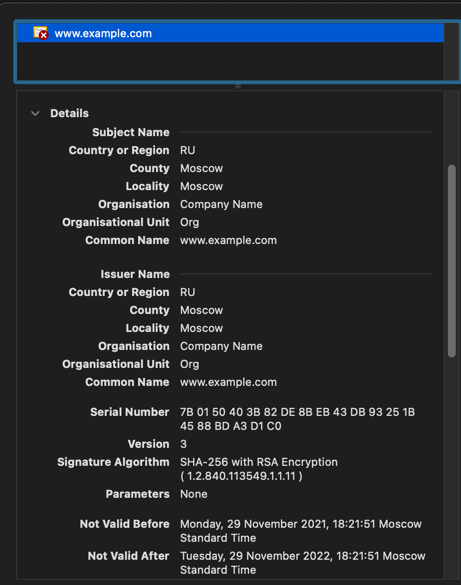
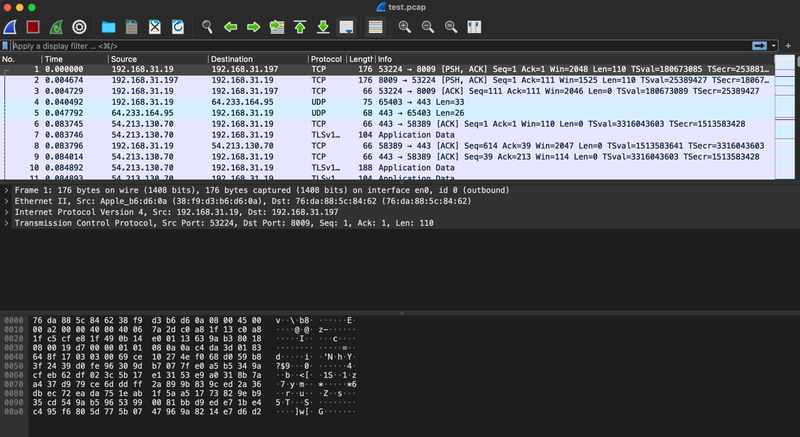

Использую ЛастПасс с Гугл аутентификатором

3. Установите apache2, сгенерируйте самоподписанный сертификат, настройте тестовый сайт для работы по HTTPS.

4. Проверьте на TLS уязвимости произвольный сайт в интернете.
```buildoutcfg
vagrant@vagrant:~/testssl.sh$ ./testssl.sh -U --sneaky https://www.airnet.ru

###########################################################
    testssl.sh       3.1dev from https://testssl.sh/dev/
    (b40d38f 2021-11-28 18:11:36 -- )

      This program is free software. Distribution and
             modification under GPLv2 permitted.
      USAGE w/o ANY WARRANTY. USE IT AT YOUR OWN RISK!

       Please file bugs @ https://testssl.sh/bugs/

###########################################################

 Using "OpenSSL 1.0.2-chacha (1.0.2k-dev)" [~183 ciphers]
 on vagrant:./bin/openssl.Linux.x86_64
 (built: "Jan 18 17:12:17 2019", platform: "linux-x86_64")


 Start 2021-11-29 15:33:53        -->> 93.92.200.221:443 (www.airnet.ru) <<--

 Further IP addresses:   2a00:6f60:0:1::1004
 rDNS (93.92.200.221):   93-92-200-221.client.airnet.ru.
 Service detected:       HTTP


 Testing vulnerabilities

 Heartbleed (CVE-2014-0160)                not vulnerable (OK), timed out
 CCS (CVE-2014-0224)                       not vulnerable (OK)
 Ticketbleed (CVE-2016-9244), experiment.  not vulnerable (OK)
 ROBOT                                     not vulnerable (OK)
 Secure Renegotiation (RFC 5746)           supported (OK)
 Secure Client-Initiated Renegotiation     not vulnerable (OK)
 CRIME, TLS (CVE-2012-4929)                not vulnerable (OK)
 BREACH (CVE-2013-3587)                    no gzip/deflate/compress/br HTTP compression (OK)  - only supplied "/" tested
 POODLE, SSL (CVE-2014-3566)               not vulnerable (OK)
 TLS_FALLBACK_SCSV (RFC 7507)              Downgrade attack prevention supported (OK)
 SWEET32 (CVE-2016-2183, CVE-2016-6329)    not vulnerable (OK)
 FREAK (CVE-2015-0204)                     not vulnerable (OK)
 DROWN (CVE-2016-0800, CVE-2016-0703)      not vulnerable on this host and port (OK)
                                           make sure you don't use this certificate elsewhere with SSLv2 enabled services
                                           https://censys.io/ipv4?q=01F81E4AB7FE880ADF1625B5C4CDE1B51C9D7AB90F97658ED81A81D4FF7061DD could help you to find out
 LOGJAM (CVE-2015-4000), experimental      not vulnerable (OK): no DH EXPORT ciphers, no DH key detected with <= TLS 1.2
 BEAST (CVE-2011-3389)                     TLS1: ECDHE-RSA-AES256-SHA AES256-SHA CAMELLIA256-SHA ECDHE-RSA-AES128-SHA AES128-SHA CAMELLIA128-SHA
                                           VULNERABLE -- but also supports higher protocols  TLSv1.1 TLSv1.2 (likely mitigated)
 LUCKY13 (CVE-2013-0169), experimental     potentially VULNERABLE, uses cipher block chaining (CBC) ciphers with TLS. Check patches
 Winshock (CVE-2014-6321), experimental    not vulnerable (OK) - CAMELLIA or ECDHE_RSA GCM ciphers found
 RC4 (CVE-2013-2566, CVE-2015-2808)        no RC4 ciphers detected (OK)


 Done 2021-11-29 15:34:39 [  49s] -->> 93.92.200.221:443 (www.airnet.ru) <<--
```
5. Установите на Ubuntu ssh сервер, сгенерируйте новый приватный ключ. Скопируйте свой публичный ключ на другой сервер. Подключитесь к серверу по SSH-ключу.
```buildoutcfg
vagrant@vagrant:~/.ssh$ ssh i.zorin@10.0.2.2
Last login: Mon Nov 29 19:04:20 2021 from 127.0.0.1
```
6. Переименуйте файлы ключей из задания 5. Настройте файл конфигурации SSH клиента, так чтобы вход на удаленный сервер осуществлялся по имени сервера.
```buildoutcfg
Host 10.0.2.2
        User i.zorin
        IdentityFile ~/.ssh/test_id_rsa
```
```buildoutcfg
vagrant@vagrant:~/.ssh$ ssh 10.0.2.2
Last login: Mon Nov 29 19:07:20 2021 from 127.0.0.1
```
7. Соберите дамп трафика утилитой tcpdump в формате pcap, 100 пакетов. Откройте файл pcap в Wireshark.
